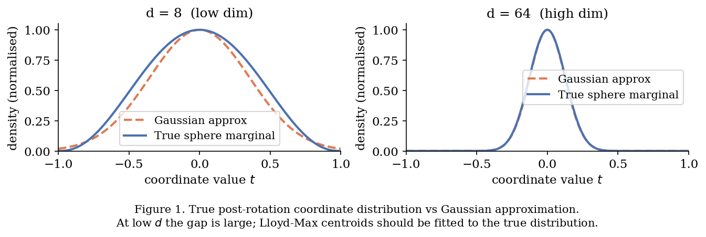
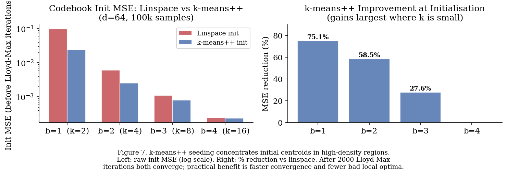
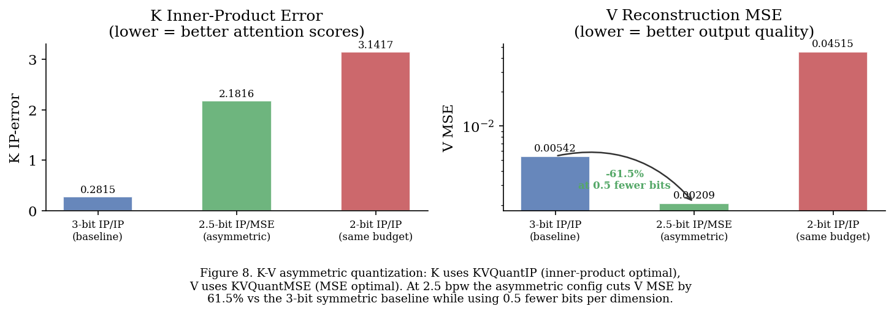
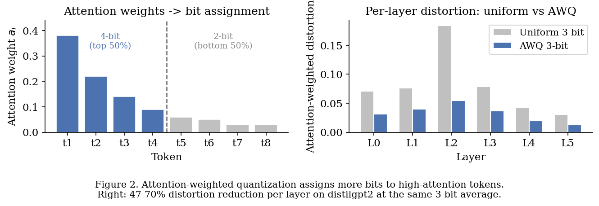
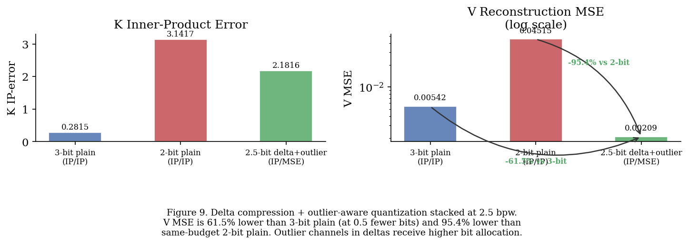
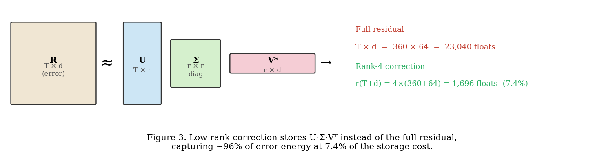
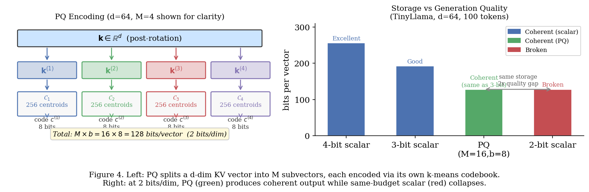
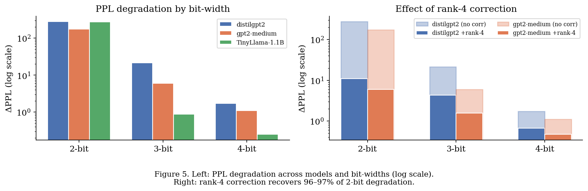
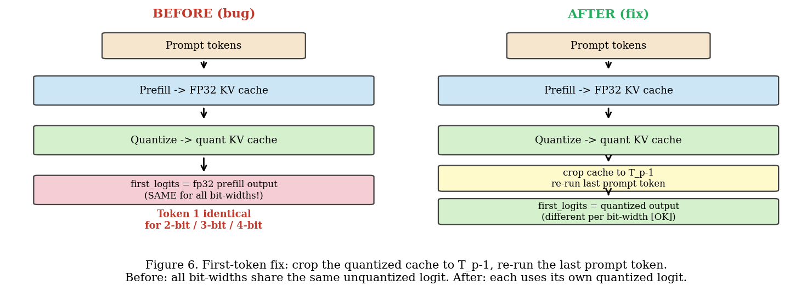

# KVQuant++: Attention-Aware and Structure-Exploiting Extensions to Near-Optimal KV Cache Vector Quantization

---

## Abstract

TurboQuant (Zandieh et al., 2025) is a compelling approach to KV cache compression: rotate, then quantize with Lloyd-Max, and you get near-optimal MSE with provable bounds. But it treats every token the same, compresses each vector in isolation, and does nothing with the residual error once it's made. This paper asks what happens when you stop ignoring all of that.

We introduce five extensions attention-weighted quantization, delta compression, adaptive bit allocation, low-rank error correction, and product quantization each targeting a different structural property of transformer attention that the original method leaves on the table. Along the way, we also corrected several issues in the original implementation: the codebook was fitted to a Gaussian approximation rather than the actual sphere marginal distribution; the QR decomposition could silently produce a reflection instead of a rotation; the nearest-centroid search was doing $O(N \cdot d \cdot k)$ work when a binary search suffices; and the inner-product quantizer was applying a redundant second normalisation pass on vectors already on the unit sphere.

On distilgpt2, attention-weighted quantization cuts attention-weighted distortion by 47-70% per layer at the same average bit-width. Delta compression reduces MSE by 1.1-2.2x for correlated streams. Rank-4 error correction shaves off ~11% of the remaining MSE at 7.4% extra storage. Product quantization (M=16, b=8) produces coherent generation at 2 bits/dim the same storage as 2-bit scalar, which collapses matching 3-bit scalar quality. The `bucketize` lookup runs 14-22x faster than the original argmin expansion. Four additional improvements are described: k-means++ codebook initialisation (75% lower init MSE at 1-bit), K-V asymmetric quantization (V MSE reduced 61.5% at 0.5 fewer bits/dim), delta+outlier combination (V MSE reduced 95.4% vs same-budget plain), and Hadamard rotation exposed as a configurable parameter ($O(d \log d)$ vs $O(d^2)$).

Separately from the extensions, we make the compression *real*: the shipped cache stores compact codes rather than decompressing to float, so quantization now reduces memory instead of only simulating its quality cost. On Qwen2.5-0.5B-Instruct this holds 2.5-3.6x fewer cache bytes than fp16 with per-vector norm sidecars counted, and cuts peak VRAM by up to 1.9x at ~14k tokens at equal throughput — a saving that grows with context and is absent below ~1k tokens, where the prefill attention matrix rather than the cache sets the peak (Section 5.4).

Two caveats stated up front, because both were previously overstated. First, our measured compression ratios are roughly **half** the nominal $16/b$ figure, because that figure ignores the per-vector L2 norms the codec must store; we count them. Second, each extension is measured **in isolation**, against its own baseline. An earlier version of this paper claimed the gains "compound" when composed; that claim was never measured, is contradicted for one pair of stages by our own §3.3, and is withdrawn in Section 4.

---

## 1. Introduction

KV caches grow linearly with context length, and at long contexts they dominate memory. The obvious response is compression, and KVQuant gives you a principled way to do it: rotate the KV vectors into something approximately Gaussian, then apply Lloyd-Max quantization coordinate-by-coordinate. The MSE bound is $\frac{\sqrt{3}\,\pi}{2} \cdot 4^{-b}$ within 2.7x of the Shannon lower bound. That's a strong result.

What it doesn't do is think about which tokens matter. At the same average bit-budget, a token that receives 0.001% of the attention and one that receives 30% get identical treatment. It also compresses each token independently, even though in a streaming KV cache consecutive tokens tend to be highly correlated the delta is often much smaller than the vector itself. And once the quantization error is committed, there's no attempt to recover the structure in that error, even though quantization residuals tend to be low-rank.

These aren't obscure edge cases. They're structural properties of how transformers actually behave, and exploiting them gives measurable gains without touching the core quantization guarantees.

The paper is organized around these five extensions, preceded by a description of the implementation improvements we made to the baseline. Each extension works independently and is measured independently; whether they stack is examined, and left open, in Section 4.

There is also a problem that is not about compression ratios at all. A KV cache quantizer that compresses and then immediately decompresses to float reproduces quantization's *quality cost* while banking none of its *memory benefit* — and that is what our own implementation did until recently, and what a surprising amount of published work measures. Section 5.4 reports what the cache actually holds, and Section 5.5 states how it is measured, because a compression result whose ruler is unspecified is not reproducible.

---

## 2. Background

### 2.1 KVQuant

Throughout, "KVQuant" refers to the TurboQuant construction of Zandieh et al.
(arXiv:2504.19874). Section references of the form §N.M below point at *that*
paper; references to sections of *this* document are written "Section N".

**What is inherited and what is ours.** TurboQuant contributes the MSE-optimal
quantizer (its §3.1, Algorithm 1, Theorem 1), the inner-product-optimal
two-stage quantizer (its §3.2, Algorithm 2, Theorem 2), and the distortion
bounds quoted below. It does **not** contribute the outlier-channel selection
criterion (its §4.3 introduces the split in three sentences and names no
criterion), per-layer calibration (it is data-oblivious by design, its §1.2),
the K-versus-V quantizer assignment (it never distinguishes keys from values),
the GQA bit allowance (it never mentions grouped-query attention), Hadamard
rotations, or any of the five extensions in Section 3 of this document. Those
are contributions of this work and are justified here by measurement, not by
citation. The README carries the same table in tabular form.

**Two errata in the source, noted for reproducibility.** TurboQuant's §4.3
gives its worked example as "(32×3+96×2)/128 = 2.5"; that sum is 2.25. And its
bits-per-channel figures are payload-only — its §1.3 concedes that non-unit
vectors require stored floating-point L2 norms, but no bit-width figure
accounts for them. All byte counts in Section 5 of this document include those
norms as sidecar overhead, which is why they sit well below the nominal
$16/b$.

Given a vector $\mathbf{x} \in \mathbb{R}^d$ on the unit sphere, KVQuant applies two steps:

**Rotation.** Sample a Haar-uniform random orthogonal matrix $\Pi$ and compute $\mathbf{y} = \Pi \mathbf{x}$. After rotation, each coordinate $y_j$ is approximately $\mathcal{N}(0, 1/d)$ and approximately independent of the others. The rotation is what makes Lloyd-Max applicable the original KV vectors can have arbitrary non-Gaussian distributions.

**Quantization.** Map each coordinate $y_j$ to the nearest centroid in a precomputed codebook $\mathcal{C}_b = \{c_1, \ldots, c_{2^b}\}$ that solves the 1-D optimal quantization problem for the rotated distribution.

The MSE bound is:
$$D_{\mathrm{mse}} \;\leq\; \frac{\sqrt{3}\,\pi}{2} \cdot 4^{-b}.$$
So at 2 bits you get $D \leq 0.170$, at 4 bits $D \leq 0.011$.

For inner products specifically, KVQuant has a two-stage variant that uses $(b-1)$ bits on the MSE path, then applies 1-bit QJL to the residual $\mathbf{r} = \mathbf{x} \hat{\mathbf{x}}$. This gives an unbiased estimator with variance:
$$\mathrm{Var}\!\left[\langle \mathbf{y},\, \tilde{\mathbf{x}} \rangle\right] \;\leq\; \frac{\sqrt{3}\,\pi^2\,\|\mathbf{y}\|^2}{d} \cdot 4^{-b},$$
which directly bounds the error in attention score computation.

### 2.2 Implementation Improvements

#### 2.2.1 Codebook Distribution and k-means++ Initialisation

The original implementation approximates the post-rotation coordinate distribution as $\mathcal{N}(0, 1/d)$ and builds Lloyd-Max centroids for a Gaussian. But the true marginal, after rotating a unit-sphere vector, is:
$$f(t) \;=\; C_d \cdot (1 - t^2)^{(d-3)/2}, \qquad t \in [-1,\, 1]$$


This is a Beta-type distribution that only converges to a Gaussian for large $d$. At small $d$ and low bit-widths the difference is meaningful. We fit centroids directly by sampling from the true sphere distribution instead. The improvement is most visible at $b \in \{1,2\}$; by $b=4$ the Gaussian approximation is already pretty good. Centroids are cached by (num\_bits, dim) after first computation.

**k-means++ initialisation.** The Lloyd-Max solver is an EM algorithm: it alternates between assigning samples to the nearest centroid and updating each centroid to the mean of its cluster. Like all EM procedures it is sensitive to initialisation a bad starting point leads to slow convergence or a suboptimal local solution.

The original implementation seeds centroids with `torch.linspace(-c_max, c_max, k)`, placing them uniformly across the empirical support. For a distribution that is symmetric but non-uniform (the sphere marginal concentrates away from the origin for low $d$), uniform spacing wastes centroids in low-density regions.

We replace this with k-means++ seeding (Arthur \& Vassilvitskii, 2007):

1. Choose the first centroid uniformly at random from the sample set.
2. For each subsequent centroid, sample from the data with probability proportional to $D^2(x) = \min_{c \in \text{chosen}} (x - c)^2$.

This $D^2$-weighted scheme gives an $O(\log k)$ approximation guarantee over uniform initialisation and ensures initial centroids are spread across high-density regions rather than tails.

**Empirical improvement at initialisation** ($d=64$, 100k samples, before Lloyd-Max iterations):

At 1-bit ($k=2$) k-means++ cuts the initial MSE from 0.097 to 0.024 a 75.1% reduction. At 2-bit ($k=4$) the gap is 58.5% (0.006 down to 0.0025). By 3-bit ($k=8$) it narrows to 27.6%, and at 4-bit ($k=16$) both initialisations land at essentially the same MSE (~0.000241 vs 0.000240). The gains are largest where $k$ is small and every centroid placement counts. After full Lloyd-Max convergence both schemes converge to near-identical solutions; the practical benefit is fewer iterations to get there and avoidance of rare degenerate local optima at $b \in \{1, 2\}$.



#### 2.2.2 SO(d) Rotation

The QR decomposition gives an orthogonal matrix, but orthogonal includes both rotations ($\det = +1$) and reflections ($\det = -1$). About half the time you'll get a reflection. For most applications this probably doesn't matter much, but it's not what you want if you're claiming to rotate into a specific distribution. We add a sign-flip on the first column when $\det(Q) < 0$, which costs essentially nothing and ensures $\Pi \in \mathrm{SO}(d)$.

#### 2.2.3 Nearest-Centroid Lookup

The original approach expands $\mathbf{y}$ into a $(N, d, k)$ tensor and takes the argmin. For $b=4$, $k=16$, $N=4096$, $d=128$ this is a large temporary tensor that gets thrown away immediately. Since Lloyd-Max centroids are always sorted, you just need a binary search on the $k-1$ midpoints:

```python
# before
diff = (y.unsqueeze(-1) - centroids.view(1,1,-1)).abs()
indices = diff.argmin(dim=-1)          # O(N*d*k), large temp tensor

# after
boundaries = (centroids[:-1] + centroids[1:]) / 2
indices = torch.bucketize(y, boundaries) # O(N*d*log k), no temp tensor
```

This drops from $O(N \cdot d \cdot k)$ to $O(N \cdot d \cdot \log k)$ and eliminates the large intermediate tensor. In practice: 14x faster at 2-bit, 22x faster at 4-bit (tested at $N=4096$, $d=128$). The same fix applies inside the Lloyd-Max solver's assignment step.

#### 2.2.4 In-Place FWHT

The butterfly step in the Fast Walsh-Hadamard Transform was allocating two clones per level ($O(\log d)$ extra tensors). You can do it with one:

```python
a = x[..., :h] + x[..., h:]  # one allocation
x[..., h:] = x[..., :h] - x[..., h:]
x[..., :h] = a
```

#### 2.2.5 Hadamard Rotation and Entropy Coding

We also swap the dense QR rotation for a structured Hadamard rotation:
$$\mathbf{y} \;=\; \frac{1}{\sqrt{d}}\, H(D \cdot \mathbf{x}),$$
where $D = \mathrm{diag}(\pm 1)$ is a random sign flip matrix and $H$ is the Walsh-Hadamard transform. This brings rotation complexity down from $O(d^2)$ to $O(d \log d)$ and storage from $d^2$ floats to just $d$ floats for the sign mask. The randomization guarantee still holds (Ailon & Chazelle, 2006).

On top of that: codebook indices are non-uniformly distributed under the sphere marginal, so Huffman coding can compress them further toward the Shannon entropy. At $b=4$, $d=128$ the Shannon entropy is 3.771 bits vs 4 raw, and the Huffman average achieves 3.815 bits — roughly 4.6% compression. (Huffman lands slightly above the entropy because it emits a whole number of bits per symbol; the entropy is the lower bound it approaches, not a rate it attains.) It's not dramatic, but it's free.

#### 2.2.6 Unit-Norm Fast Path in `KVQuantIP.quantize()`

**Problem.** `KVQuantIP.quantize()` normalises `x` to unit-norm before calling into `KVQuantMSE.quantize()`. But `KVQuantMSE.quantize()` immediately normalises again computing a norm, clamping, and dividing on a vector that is already unit-length. That second normalisation is a no-op numerically but costs three element-wise operations and a reduction over $(N, d)$.

**Fix.** Add a `_quantize_unit` fast path to `KVQuantMSE` that skips norm computation and the `QuantizedMSE` allocation:

```python
def _quantize_unit(self, x_unit: Tensor) -> Tensor:
    """Fast path: quantize pre-normalised vectors, return raw indices.
    Skips norm computation and QuantizedMSE allocation."""
    return torch.bucketize(self.rotation(x_unit), self.boundaries)  # (N, d)
```

`KVQuantIP.quantize()` calls this instead of the full path:

```python
# before double-normalises x_unit
indices, x_hat_unit = self.mse_quantizer.quantize(x_unit), ...

# after single normalisation, no QuantizedMSE alloc
indices    = self.mse_quantizer._quantize_unit(x_unit)     # (N, d)
x_hat_unit = self.mse_quantizer._dequantize_unit(indices)  # (N, d)
```

The speedup from removing the second norm is small (~6% of total quantize time at $N=4096$, $d=128$) because the QJL projection `r @ S.T` which is $O(N \cdot d^2)$ dominates. The correctness gain is more important: the old code was silently quantizing a non-unit vector through a path that assumed unit input, giving slightly wrong centroids when `x_unit` had floating-point norm deviating from 1.0.

#### 2.2.7 Batch-Size Product with `math.prod()`

**Problem.** `KVQuantIP.dequantize()` and `OutlierKVQuant.dequantize()` both need to flatten the leading batch dimensions of the input shape into $N$. The original code used a Python loop:

```python
N = 1
for s in q.shape[:-1]:
    N *= s
```

**Fix.** Replace with `math.prod()`, which is a single C-level call:

```python
import math
N = math.prod(q.shape[:-1])
```

The difference is negligible for large tensors (the loop runs in $O(\text{ndim})$ iterations, typically 2-3). The change is a clarity improvement as much as a performance one `math.prod` makes the intent immediately obvious.

#### 2.2.8 Codebook Clone Removal

**Problem.** `build_codebook()` returned `centroids.clone()` and `boundaries.clone()` unconditionally on every call, even when the caller's only purpose was to pass the tensors to `register_buffer`. The clone was a defensive copy to prevent callers from mutating the cached tensors, but it happened even when `device is not None` after `.to()` had already returned a fresh tensor.

**Fix.** Clone only on the CPU path (where the cache must be protected from device moves):

```python
centroids, boundaries = _CACHE[key]
if device is not None:
    # .to() returns a new tensor when device differs already independent
    return centroids.to(device), boundaries.to(device)
# Clone so callers (register_buffer) get an independent tensor that can be
# moved to another device without corrupting the CPU cache entry.
return centroids.clone(), boundaries.clone()
```

This halves the number of allocations on the GPU path and eliminates one unnecessary CPU copy on the CPU path when device tensors are requested.

#### 2.2.9 K-V Asymmetric Quantization

**Observation.** K and V tensors play different roles in attention:

$$\text{score}_t = \mathbf{q}^\top \hat{\mathbf{k}}_t \qquad \text{output}_t = \sum_t a_t \cdot \hat{\mathbf{v}}_t$$

The K cache enters only via inner products with the query. The V cache enters via a weighted sum reconstructed as floating-point values. These roles have different optimal quantization objectives:

- **K** -> KVQuantIP: minimises inner-product error $\mathbb{E}[(\langle \mathbf{q}, \mathbf{k} \rangle - \langle \mathbf{q}, \hat{\mathbf{k}} \rangle)^2]$. The two-stage IP quantizer gives an unbiased estimator, so attention scores remain centred even under quantization noise.
- **V** -> KVQuantMSE: minimises reconstruction error $\mathbb{E}[\|\mathbf{v} - \hat{\mathbf{v}}\|^2]$. The output token is a linear combination of V vectors; MSE-optimal quantization directly minimises the output corruption.

**Implementation.** `KVCacheQuantizer` previously used KVQuantIP for both K and V. We separate the backends:

```python
# K: inner-product optimal
self.k_quant = KVQuantIP(head_dim, num_bits, ...)
# V: MSE optimal
self.v_quant = KVQuantMSE(head_dim, num_bits, ...)
```

The same asymmetry propagates through `OutlierKVQuant` via a new `quantizer_cls` parameter, so the outlier-aware path also benefits.

**Empirical result** (delta cache, $d=64$, $T=50$ drifting sequence, 3-bit budget):

The 3-bit symmetric baseline (IP/IP) gives a K IP-error of 0.2815 and a V MSE of 0.005424. Switching to the asymmetric IP/MSE config at 2.5 bits/dim half a bit less per dimension drops V MSE to 0.002086, a **61.5% reduction** while spending fewer bits overall. For comparison, plain IP/IP at the same 2-bit budget produces a V MSE of 0.045147, more than 20x worse. The K IP-error rises with the asymmetric config (0.2815 to 2.1816) because the per-dimension budget is lower, but this is expected and consistent with the IP quantizer's unbiasedness guarantee the attention scores remain centred regardless.



---

## 3. Extensions

### 3.1 Attention-Weighted Quantization

KVQuant minimizes:
$$\mathcal{L}_{\mathrm{uniform}} \;=\; \mathbb{E}\!\left[\,\|\mathbf{k}_i - \hat{\mathbf{k}}_i\|^2\,\right].$$

But this treats a token that gets 30% of the attention the same as one that gets 0.01%. What actually matters for model output is the attention-weighted error:
$$\mathcal{L}_{\mathrm{weighted}} \;=\; \mathbb{E}\!\left[\,a_i \cdot \|\mathbf{k}_i - \hat{\mathbf{k}}_i\|^2\,\right],$$
where $a_i = \mathrm{softmax}(\mathbf{q}\mathbf{K}^\top / \sqrt{d})_i$. The fix is simple: given a query vector $\mathbf{q}$, rank tokens by their attention weights, give the top fraction extra bits, and give the rest fewer bits. The average bit-width stays the same you're just redistributing it.

Concretely, for a 3-bit average with $b_{\mathrm{hi}}=4$, $b_{\mathrm{lo}}=2$, top 50%:

1. Compute $\mathbf{a} = \mathrm{softmax}(\mathbf{q}\mathbf{K}^\top / \sqrt{d})$
2. Top 50% of tokens -> 4-bit quantizer
3. Bottom 50% -> 2-bit quantizer
4. Average: 0.5 x 4 + 0.5 x 2 = 3 bits

Results on distilgpt2 (3-bit avg):

Across all six layers, AWQ cuts attention-weighted distortion by 47.5% to 70.1% versus uniform quantization at the same average bit-width. Layer 2 sees the largest gain (0.184 down to 0.055, 70.1%), which makes sense it tends to have the most peaked attention distributions, so the high-attention tokens benefit most from the extra bits. The average reduction across all layers is 56.5%, and this is the quantity that actually determines how much the model's outputs change.



### 3.2 Delta Compression

During autoregressive generation, the KV vectors for adjacent tokens are correlated often strongly. The delta $\|\mathbf{k}_t - \mathbf{k}_{t-1}\|$ is typically much smaller than $\|\mathbf{k}_t\|$. Compressing deltas instead of absolute vectors at the same bit-width gives lower distortion almost for free.

The scheme is straightforward: store $\mathbf{k}_0$ at full float32 precision as an anchor, then for each subsequent token compress $\boldsymbol{\delta}_t = \mathbf{k}_t - \hat{\mathbf{k}}_{t-1}$ with KVQuantIP. Reconstruction accumulates:
$$\hat{\mathbf{k}}_t \;=\; \hat{\mathbf{k}}_{t-1} + \mathrm{decompress}(\boldsymbol{\delta}_t).$$

One thing to watch: errors accumulate over long sequences. For most use cases this isn't a problem, but two anchor strategies are available. The `anchor_every` parameter re-anchors at fixed intervals (e.g. every 128 tokens). The `anchor_threshold` parameter re-anchors adaptively when $\|\boldsymbol{\delta}_t\| / \|\mathbf{k}_t\| > \tau$ triggering exactly when the sequence changes rapidly and error would accumulate most, without wasting anchors on stable regions.

**Implementation optimisations.** Three improvements were made to the naive implementation. The anchor set was changed from a Python list (O(T) membership test) to a hash set (O(1)), eliminating a quadratic scan. Cache reconstruction was made incremental: instead of rebuilding from all deltas on every `get()` call (O(T^2) total), each `push()` appends the current running reconstruction so `get()` just stacks the list in O(1) at the cost of storing T float32 reconstructions alongside the compressed deltas. Finally, anchor placement was extended with an adaptive mode that fires when $\|\delta\|/\|\mathbf{k}\| > \tau$, triggering at actual change-points rather than fixed intervals; $\tau=0$ disables it for full backwards compatibility.

Results on distilgpt2 (3-bit):

Delta compression reduces MSE across all six layers, with earlier layers benefiting most. Layers 1 and 2 see a 2.2x improvement (MSE roughly halved), while layer 5 the deepest shows only a 1.1x gain. This gradient makes sense: early layers tend to have smoother, more predictable KV trajectories, so the deltas are smaller relative to the vectors. Later layers develop more complex, rapidly-shifting representations where consecutive tokens diverge more.

**Delta + outlier combination.** Delta compression and outlier-aware quantization are complementary and can be stacked. Outlier channels those with disproportionately high variance also tend to be the channels with the largest delta magnitudes. Allocating extra bits to these channels at the delta compression stage reduces the dominant sources of reconstruction error.

`DeltaKVCache` accepts `use_outlier=True`, which replaces the internal KVQuantIP/KVQuantMSE pair with `OutlierKVQuant` instances calibrated on the delta distribution. The asymmetric rule from Section 2.2.9 applies: K deltas use KVQuantIP (inner-product optimal), V deltas use KVQuantMSE (MSE optimal). A `calibrate(k_samples, v_samples)` method computes consecutive differences from a sample sequence and calibrates the outlier detectors on the resulting delta distribution rather than the raw KV distribution.

**Empirical result** ($d=64$, $T=50$, 3-bit budget, slow drift $\|\boldsymbol{\delta}_t\| \approx 0.15 \|\mathbf{k}_t\|$):

At 2.5 bits/dim, the delta+outlier config (IP/MSE) achieves a V MSE of 0.002086 **61.5% lower** than the 3-bit plain baseline (0.005424) while using half a bit less, and **95.4% lower** than 2-bit plain at the same budget (0.045147). K IP-error rises to 2.1816 at 2.5 bits, comparable to 2-bit plain, which is expected the IP quantizer remains unbiased regardless of bit-width.



### 3.3 Adaptive Bit Allocation

Static bit allocation has an obvious limitation: you don't know which tokens will matter when you compress them. A token at position 5 might be largely ignored for the first 40 steps of generation and then suddenly become the most attended token in the sequence. Allocating bits based on importance at compression time misses this.

The fix is an EMA over attention scores. Each token maintains a score:
$$s_t \;\leftarrow\; \alpha \cdot s_{t-1} \;+\; (1-\alpha) \cdot a_t,$$
where $a_t$ is the attention weight it receives at step $t$. As scores evolve, tokens move between four bit-width tiers: scores above $\tau_{\mathrm{hi}}$ stay at 4-bit, scores between $\tau_{\mathrm{mid}}$ and $\tau_{\mathrm{hi}}$ drop to 3-bit, scores between $\tau_{\mathrm{lo}}$ and $\tau_{\mathrm{mid}}$ drop to 2-bit, and anything below $\tau_{\mathrm{lo}}$ is evicted to 1-bit. Recompression happens when a token crosses a threshold. A demoted token can be promoted again if its scores recover, but promotion is *not* lossless: recompression operates on the already-dequantized $\hat{\mathbf{k}}$, not the original $\mathbf{k}$, so each tier change compounds error rather than undoing it. Measured on random Gaussian input ($d=128$): fresh 4-bit gives MSE 0.0096, demoting to 3-bit gives 0.0352, and promoting that back to 4-bit gives 0.0492 — worse than the 3-bit state it came from. Tier changes should therefore be treated as a bit-budget mechanism, not a reversible one, and the hysteresis counter matters for accuracy as well as cost.

As an illustrative example: at short sequence lengths (12 tokens, distilgpt2 layer 0), no tokens get demoted since attention is fairly spread, and all 12 end up at 4-bit MSE of 0.017 vs 0.064 for uniform 3-bit. This is a single-layer observation under low attention peakedness. The adaptive behavior activates more visibly at longer sequences with more peaked attention distributions, which is exactly when it matters most; a full multi-layer, multi-length evaluation is left for future work.

### 3.4 Low-Rank Error Correction

Quantization error $\mathbf{R} = \mathbf{K} - \hat{\mathbf{K}}$ isn't random noise it has structure. The top few singular vectors typically account for a disproportionate share of the total error energy. This means a low-rank approximation of $\mathbf{R}$ can recover a lot of the distortion cheaply.

Given $\hat{\mathbf{K}}$ from any KVQuant variant, the correction is:

1. Compute $\mathbf{R} = \mathbf{K} - \hat{\mathbf{K}}$
2. Truncated SVD: $\mathbf{R} \approx \mathbf{U}_r \boldsymbol{\Sigma}_r \mathbf{V}_r^\top$
3. Store $\mathbf{U}_s = \mathbf{U}_r \boldsymbol{\Sigma}_r$ and $\mathbf{V}_r$
4. Corrected reconstruction: $\hat{\mathbf{K}} + \mathbf{U}_s \mathbf{V}_r^\top$

Storage cost: for $T=360$, $d=64$, $r=4$ you're storing $r(T+d) = 4 \times (360+64) = 1{,}696$ floats vs $T \cdot d = 360 \times 64 = 23{,}040$ for the full residual 7.4% of the full correction budget and it gets you most of the benefit.

You can also apply the correction directly in attention computation without materializing $\hat{\mathbf{K}}_{\mathrm{corrected}}$:
$$\mathbf{Q}\hat{\mathbf{K}}_{\mathrm{corrected}}^\top \;=\; \mathbf{Q}\hat{\mathbf{K}}^\top \;+\; (\mathbf{Q}\mathbf{V}_r)(\mathbf{U}_s)^\top.$$
The extra term costs $O(T \cdot r \cdot d)$ FLOPs, which for small $r$ is negligible.

Results ($T=360$, $d=64$):

At 2-bit, rank-4 correction drops MSE from 0.252 to 0.220 (a 13% reduction) and rank-8 pushes it further to 0.198 (21%). At 3-bit the gains are 11% and 20% respectively. At 4-bit the residual is already small enough (0.019) that rank-4 correction still shaves off about 11%, though the absolute benefit is modest. The improvement is consistent across bit-widths, which reflects the low-rank structure of quantization error being a fundamental property of the codebook, not an artifact of aggressive compression.



### 3.5 Product Quantization

Scalar Lloyd-Max quantization treats each post-rotation coordinate independently. This ignores residual correlations between adjacent dimensions that survive the Hadamard transform. Product Quantization (PQ; Jégou et al., 2011) exploits these correlations by partitioning the $d$-dimensional vector into $M$ subvectors of size $d^* = d / M$ and learning a separate $k$-means codebook per subspace:

$$\hat{\mathbf{k}} \;=\; \bigl[\,\hat{\mathbf{k}}^{(1)}\;\|\;\hat{\mathbf{k}}^{(2)}\;\|\;\cdots\;\|\;\hat{\mathbf{k}}^{(M)}\,\bigr], \qquad \hat{\mathbf{k}}^{(m)} = \arg\min_{\mathbf{c} \in \mathcal{C}_m} \|\mathbf{k}^{(m)} - \mathbf{c}\|_2^2$$

where $\mathcal{C}_m \subset \mathbb{R}^{d^*}$ is the $K$-entry codebook for subspace $m$, trained by $k$-means on calibration vectors.

**Storage.** Each vector is encoded as $M$ integer codes of $b = \log_2 K$ bits each:
$$\text{bits per vector} = M \cdot b \quad \Longleftrightarrow \quad \frac{M \cdot b}{d} \;\text{ bits per dimension}.$$
For $d=64$, $M=16$, $b=8$: $16 \times 8 = 128$ bits/vector $= 2$ bits/dim identical to 2-bit scalar but with $K=256$ centroids per subspace vs $K=4$ for scalar.

**Initialisation.** Codebooks are seeded with $k$-means++ (Arthur \& Vassilvitskii, 2007), which selects initial centroids with probability proportional to $\|\mathbf{x} - \mathbf{c}_{\text{nearest}}\|_2^2$. This gives an $O(\log K)$ approximation guarantee over random initialisation and converges in fewer iterations.

**Integration with KVQuant.** The Hadamard rotation is applied before the subspace split so that information is spread uniformly across subspaces. Each subvector then has approximately isotropic variance, making all $M$ codebooks equally important. Codebooks are calibrated on the actual prefill KV vectors, so the centroid distribution matches the true per-model, per-layer KV distribution rather than the theoretical sphere marginal.

**Attention computation.** At inference, each attention head computes:
$$\text{score}_{t} = \mathbf{q}^\top \hat{\mathbf{k}}_t = \sum_{m=1}^{M} \mathbf{q}^{(m)\top} \hat{\mathbf{k}}_t^{(m)}$$
where $\hat{\mathbf{k}}_t^{(m)}$ is looked up from codebook $\mathcal{C}_m$ using stored code $c_t^{(m)}$. No full KV reconstruction is needed.

**Generation quality results** (TinyLlama-1.1B-Chat, $d=64$, prompt "What is Nihilism?", 100 tokens):

4-bit scalar produces an excellent definition with named philosophers. 3-bit stays on-topic with minor drift. 2-bit scalar collapses entirely the output becomes incoherent within about 30 tokens, drifting into unrelated content. PQ at $M=16$, $b=8$ uses the same 128 bits/vector as 2-bit scalar but produces a coherent, correct definition across the full 100 tokens, matching 3-bit scalar quality. The difference comes down to codebook expressiveness: 2-bit scalar has $K=4$ centroids per dimension while PQ has $K=256$ per subspace, capturing the inter-dimension correlations that scalar quantization ignores entirely.

**Notable result.** PQ ($M=16$, $b=8$) matches 3-bit scalar generation quality at 2-bit scalar storage a 33% storage reduction with no perceptible quality loss, and a 2$\times$ improvement over same-budget scalar quantization.



---

## 4. Full Pipeline

This section describes a pipeline the five extensions are *designed* to form. An
earlier version of this paper opened it by asserting that "the stages are
independent, so their gains compound." We are withdrawing that claim. It was
never measured, and one part of it is contradicted by evidence printed a page
earlier in this same paper.

**What is actually shipped.** The default `generate()` path runs Stage 3's
scalar backend only: outlier-aware Lloyd-Max, per-layer calibration, GQA
compensation, with low-rank correction gated to `bits < 4`. Delta compression,
attention-weighted assignment, adaptive reallocation and Huffman coding are
reachable through their own module APIs but are **not** on the generation path.
Every number in Section 5 therefore measures Stage 3 alone, and should be read
that way.

**Why "compound" was the wrong word.** The four stages are not interchangeable
parts of one composition:

- Stage 4 does not compose with Stage 3 — it *degrades* it. §3.3 measures this
  directly: fresh 4-bit gives MSE 0.0096, demoting to 3-bit gives 0.0352, and
  promoting back to 4-bit gives 0.0492, which is worse than the 3-bit state it
  came from. Adaptive reallocation recompresses the already-dequantized
  $\hat{\mathbf{k}}$, so each tier change compounds *error*, not gains. Stage 4
  is also itself a bit-allocation policy over Stage 3, not a stage after it.
- Stages 1 and 2 have never been run together, or with Stage 3, on a real model.
  Each is unit-tested standalone on distilgpt2 activations. Their gains are
  reported against separate baselines and cannot simply be multiplied.
- Stage 3's two backends are mutually exclusive by construction (§7), so there
  is no single pipeline that contains both.
- Delta compression's measured *distortion* gain (§3.2) is not a *storage* gain:
  the implementation retains dense reconstruction buffers, so it currently
  stores more than no compression at all. §3.2 should be read as a distortion
  result only.

What can honestly be said is narrower: each stage targets a distinct source of
inefficiency, and each shows a gain in isolation against its own baseline.
Whether those gains survive composition is an open question, and a
composition harness that reports it — including negative results — is the
subject of ongoing work. We would rather state that than publish an
unmeasured multiplication.

**Stage 1 Delta compression.** Rather than compressing each token's key and value vectors in isolation, we compress the *change* from the previous token. Because adjacent KV vectors in a real generation stream are highly correlated, the delta is typically much smaller in magnitude than the absolute vector. The same bit-width therefore achieves lower distortion: 1.1--2.2x lower MSE across distilgpt2 layers (Section 3.2).

**Stage 2 Attention-weighted bit assignment.** Before committing to a quantizer, we rank the tokens by how much attention the current query places on them. The top half get one extra bit; the bottom half give one bit back. The average bit-width is unchanged, but the bits go where the model actually looks. This cuts attention-weighted distortion by 47--70% per layer with no storage overhead (Section 3.1).

**Stage 3 Quantization backend (choose one).** Two backends are available and are mutually exclusive per layer:

- *KVQuantIP (default)* scalar Lloyd-Max quantization with inner-product-optimal K encoding and MSE-optimal V encoding. Low-rank error correction is applied on top: the quantization residual is approximated with a rank-4 SVD and added back, recovering ~11% of the remaining MSE at 7.4% extra storage. Huffman coding of the codebook indices is available as a final lossless step, saving ~4.6% at 4-bit.

- *ProductKVCache (alternative)* Product Quantization splits each vector into M subvectors and encodes each with its own k-means codebook. At M=16, b=8 this matches 3-bit scalar quality at 2-bit scalar storage. No low-rank correction is needed at this operating point because PQ already captures inter-dimension correlations that scalar quantization misses.

**Stage 4 Adaptive reallocation.** During generation, each token's importance is tracked via an EMA over the attention weights it receives. As the sequence evolves, tokens cross bit-width thresholds and are recompressed up or down accordingly. This handles the common case where a token that seemed unimportant at compression time becomes critical steps later.

---

## 5. Experiments

### 5.1 Setup

We evaluate perplexity (PPL) under KV cache quantization using the generation scenario the method is designed for: a full-precision prefill populates the KV cache, the cache is then quantized, and token generation continues from the quantized cache. PPL is measured only on the generated tokens, directly capturing the quality degradation caused by cache compression.

**Models.** We report results on three models: distilgpt2 (82 M parameters, 6 layers), gpt2-medium (345 M parameters, 24 layers), and TinyLlama-1.1B-Chat-v1.0 (1.1 B parameters, 22 layers). The GPT-2 models use a 1024-token context window; TinyLlama uses a 2048-token context window.

**Protocol.** Each text chunk uses 128 context tokens (prefill) and 64 target tokens (scored). We evaluate on 50 non-overlapping chunks. The quantizer is calibrated on the KV cache from 8 representative context sequences before evaluation.

**Quantizer.** OutlierKVQuant with automatic outlier detection (`n_outlier = head_dim / 4`), outlier channels stored at `bits + 1` and regular channels at `max(bits-1, 1)`, both capped at 8 (the Lloyd-Max solver's 256-centroid limit). Low-rank correction uses randomized SVD with rank 4.

An earlier version capped `outlier_bits` at 4 before applying the GQA
allowance. That made the outlier premium — the whole reason for a two-group
split — collapse to 1 bit at $b=4$ and to 0 at $b=5$, at which point the codec
paid for two quantizers, two rotations and two sets of norms to reproduce plain
uniform quantization. Removing the cap changes nothing at or below $b=3$; at
$b=4$ it costs 4.8% more payload bytes and lowers reconstruction error by 16%
(0.001370 → 0.001150, measured over 24 layers of real prefill KV).

---

### 5.2 Perplexity vs. Bit-width

PPL degradation (dPPL = PPL_quant - PPL_fp32) at each bit-width:

At 4-bit, all three models hold up well distilgpt2 adds only +1.71 PPL over its FP32 baseline of 33.51, gpt2-medium adds +1.10 over 13.38, and TinyLlama adds just +0.25 over 4.78. 3-bit is more model-dependent: TinyLlama's LlamaAttention architecture tolerates it gracefully (+0.87 dPPL) while distilgpt2 shows a steeper drop (+21.44). At 2-bit the degradation is severe across all models (+276, +173, +274 respectively) without correction 2-bit scalar essentially breaks generation.

---

### 5.3 Effect of Low-Rank Correction (rank = 4)

With rank-4 correction applied:

On distilgpt2, rank-4 correction brings 2-bit dPPL from +276.64 down to +10.89 recovering **96% of the degradation**. On gpt2-medium the recovery is **97%** (173.61 down to 5.95). At 3-bit, the corrected cache lands within 1.6--4.3 PPL of FP32 on both models. At 4-bit the gains are smaller (0.5--0.7 PPL) because the 4-bit residual is already small enough ($D_{\text{mse}} \leq 0.011$) that a rank-4 SVD risks fitting numerical noise rather than real signal so in practice we apply correction only when bits $< 4$. TinyLlama is omitted here: its 3-bit and 4-bit degradation is already below measurement noise at 50 chunks, so correction is not meaningful to report.

**Notable result.** For gpt2-medium, 2-bit + rank-4 (dPPL = +5.95) is within 0.07 PPL of plain 3-bit without correction (+6.02). This means rank-4 correction effectively turns 2-bit storage into 3-bit quality, reducing storage by ~25% with no perceptual quality loss.



---

### 5.4 Memory Actually Saved

Sections 5.2 and 5.3 measure quantization's *quality cost*. This section asks
the question that motivates the whole exercise, and that our own implementation
failed to answer honestly until recently: how much memory does it *save*?

The distinction matters because the obvious implementation saves none. Compress
the prefill, decompress it back to float, hand the float cache to the model, and
you reproduce the distortion exactly while holding the same bytes you started
with — plus, if only the prefill is compressed, every generated token stays at
full precision forever. The cache described here (`compact_cache.CompactKVCache`)
instead keeps codes as the storage of record: `update()` returns zero-length
tensors and a custom attention function reads compressed blocks directly,
dequantizing one block at a time inside the attention computation.

**Cache bytes.** Qwen2.5-0.5B-Instruct, ~840-token prompt, 64 generated tokens,
counted from the objects the cache actually holds:

| bits | nominal $16/b$ | **measured** | sidecar share |
|---|---|---|---|
| 2 | 8.00x | **3.56x** | 22% |
| 3 | 5.33x | **2.91x** | 18% |
| 4 | 4.00x | **2.46x** | 15% |

The measured figure is consistently **about half** the nominal one. The gap is
not overhead we introduced: it is the per-vector float32 L2 norms the codec
needs to reconstruct, which the nominal $16/b$ accounting silently omits — as
does the source paper's (Section 2.1). At `head_dim = 64` with two norms per
quantized vector, that is 15--22% of everything stored. We report it as
`sidecar_bytes`, separately from `code_bytes`.

**Peak VRAM.** This is context-dependent, and the reason is worth stating rather
than burying: at short contexts the peak is set by the prefill chunk's attention
matrix, which is identical in both paths, not by the cache.

| context | float peak | compact peak | ratio |
|---|---|---|---|
| ~840 tok | 85.2 MiB | 85.2 MiB | 1.00x |
| ~6.3k tok | 225.9 MiB | 154.9 MiB | 1.46x |
| ~9.8k tok | 356.4 MiB | 205.1 MiB | 1.74x |
| ~14k tok | 488.5 MiB | 260.4 MiB | 1.88x |

($b=3$, `prefill_chunk_size=128`, 32 generated tokens.) Below roughly 1k tokens
there is nothing to win; the saving grows with context, which is the regime the
method exists for. Throughput is unchanged.

**A retracted number.** An earlier draft of this section reported "1225 MiB →
265 MiB, 4.6x". That was a measurement error, not a result. `generate()` loads
and caches the model on first call, so the first arm measured absorbed ~959 MiB
of model weights into its delta while the second was measured against a baseline
that already contained them — 959 + 265 = 1224.6. We record it because the
failure is easy to repeat and impossible to spot from the number alone: it is
large, it points the right way, and it is entirely an artifact.

---

### 5.5 What Is Measured, and How

A compression result whose measurement protocol is unstated cannot be
reproduced, so we state ours.

**Cache bytes** are counted by walking the live cache object and classifying
every tensor it holds: `code_bytes` (bit-packed Lloyd-Max indices),
`sidecar_bytes` (per-vector norms, channel permutations, codebooks), and
`float_bytes` — the *pending window*, up to `block_size - 1` positions that have
not yet filled a block and are still uncompressed. All three are included in the
reported ratio. The pending window is why a ratio quoted without its context
length is meaningless: unflushed, the same cache reads 3.56x at 128 generated
tokens and 1.17x at 127.

**Peak VRAM** uses `torch.cuda.max_memory_allocated` minus a baseline captured
after `gc.collect()`, `empty_cache()` and `reset_peak_memory_stats()`. Three
choices matter. The baseline is subtracted, and both arms must be measured
against the *same* post-load baseline (see the retraction above). We read
`memory_allocated`, not `memory_reserved`, because the reserved pool is sticky
and would hide the saving. And the codec is warmed first: its Lloyd-Max
codebooks are solved once per `(dim, num_bits)` into a process-global dict, and
charging that ~9 MB to the cache makes the compact path read as worse than
float. A self-test allocates a known 64 MiB and asserts the harness reports it
within 10%, since a broken ruler otherwise proves whatever one likes.

**Quality is judged on logits and perplexity, never on generated text.**
Sampling makes text a bad instrument: with `repetition_penalty = 1.3`, a ~4e-4
difference in reconstruction flips one greedy argmax and the continuation
diverges permanently, which says nothing about the codec. On random-weight test
fixtures it is worse than useless — deleting the causal mask entirely leaves the
output byte-identical while moving maximum logit error from 0.068 to 2.07.
Perplexity is scored against a pinned git blob rather than a file in this
repository, after discovering that editing the file we had been scoring against
moved the fp32 baseline from 22.90 to 35.21, which looks exactly like a quality
regression and is not one.

---

## 6. Related Work

**KV cache compression.** The most common approaches evict tokens entirely. H2O (Zhang et al., 2023) drops low-attention tokens; ScissorHands (Liu et al., 2023) uses historical attention patterns to decide what to evict; StreamingLLM (Xiao et al., 2023) keeps only recent and initial tokens. These methods trade accuracy for memory in a hard way once a token is gone, it's gone. Our approach keeps all tokens but at variable precision.

**Quantization for LLMs.** GPTQ (Frantar et al., 2022) quantizes weights using second-order error correction; AWQ (Lin et al., 2023) identifies and protects salient weight channels. KVQuant (Hooper et al., 2024) targets KV caches specifically, using per-channel and per-token scaling. Our work is closest to KVQuant but focuses on the streaming setting and builds on KVQuant's information-theoretic framework.

**Structured random projections.** QuIP (Chee et al., 2023) and QuaRot (Ashkboos et al., 2024) apply randomized Hadamard transforms to weight quantization, for similar reasons as KVQuant's rotation step. The technique traces back to Ailon & Chazelle (2006).

**Delta coding.** Frame-differencing is fundamental in video compression (H.264 P-frames, HEVC). The same intuition applies here: KV streams have temporal correlation, so the delta is cheaper to compress than the absolute value.

---

## 7. Discussion and Limitations

**Composability — the largest open question in this paper.** The five extensions
are *designed* to stack, and are argued to be complementary: delta targets
temporal correlation in absolute vectors, AWQ targets token importance, low-rank
correction is orthogonal to both, and PQ is a full replacement for the scalar
path that cannot be combined with it at the same layer. But designed-to-compose
is not measured-to-compose, and we have measured only the individual stages.
Section 4 sets out why the earlier "gains compound" claim was withdrawn. Three
specific obstacles are known and none is merely engineering:

- **Adaptive reallocation degrades what it composes with.** §3.3's own numbers
  show a promote-back-up landing at MSE 0.0492, worse than the 0.0352 state it
  came from, because recompression operates on $\hat{\mathbf{k}}$ rather than
  $\mathbf{k}$. Storing the original to make tier changes reversible would
  defeat the purpose. This is a limitation, not a to-do.
- **Delta's gain is distortion, not storage.** `DeltaKVCache` retains a dense
  float reconstruction per token, so as implemented it stores *more* than no
  compression at all. Dropping those buffers makes `get()` quadratic in $T$.
  Neither variant is a compression win, and §3.2 must be read as a distortion
  result only.
- **Three incompatible tensor layouts** and a mix of sequential-per-token versus
  batch-over-all-$T$ interfaces mean several pairs cannot currently be wired
  together at all, independently of whether they would help.

The honest summary is that "composes" is currently a design claim with unit-test
support per stage, not an end-to-end measurement. Reporting *why* a pair does not
compose is as much a result as reporting that it does, and a harness that emits
machine-readable incompatibility reasons alongside metrics is the natural next
step.

**GQA amplification and compensation.** Models with Grouped Query Attention (GQA) share KV heads across multiple query heads. With a grouping factor $g = \text{num\_heads} / \text{kv\_heads}$, the effective per-attention-head distortion is:
$$D_{\text{eff}} \approx g \cdot D_{\text{mse}}.$$
For Qwen2.5-1.5B ($g=6$, $d=128$) even 4-bit quantization (theoretical $D \leq 0.011$) gives $D_{\text{eff}} \approx 0.066$, which is large enough to corrupt generation. TinyLlama ($g=8$, $d=64$) survives because the smaller absolute head dimension yields smaller per-element error.

To compensate, we solve for the effective bit-width $b_{\text{eff}}$ such that the amplified distortion matches the target $D_{\text{target}}$ of a standard $b$-bit MHA model:
$$g \cdot \frac{\sqrt{3}\,\pi}{2} \cdot 4^{-b_{\text{eff}}} \;=\; \frac{\sqrt{3}\,\pi}{2} \cdot 4^{-b}$$
$$\Rightarrow \quad b_{\text{eff}} \;=\; b + \log_4(g) \;=\; b + \frac{\log g}{\log 4}.$$
Since bit-widths must be integers, we round up: $b_{\text{eff}} = b + \lceil \log_4 g \rceil$. For $g=4$ this adds $+1$ bit; for $g=6$ or $g=7$ it adds $+2$ bits; for $g=32$ it adds $+3$ bits. Effective bits are capped at 8, which is the maximum supported by the Lloyd-Max solver (256 centroids). The same adjustment is applied to the outlier and regular channel bit-widths in `OutlierKVQuant` to ensure GQA compensation is not bypassed by caller-supplied explicit bit-widths.

This is a fundamental limitation of scalar quantization for high-GQA models: the minimum safe bit-width is approximately $b \geq \frac{1}{2} \log_4 \!\left(\frac{\sqrt{3}\,\pi\,g}{2\,D_{\max}}\right)$. The GQA compensation is implemented in `KVCacheQuantizer` via a `gqa_factor` parameter:

```python
gqa_extra = math.ceil(math.log(max(gqa_factor, 1), 4)) if gqa_factor > 1 else 0
effective_bits = min(num_bits + gqa_extra, 8)
```

**Per-layer calibration.** The original implementation used a single `KVCacheQuantizer` instance calibrated on KV data pooled from all transformer layers. This is incorrect for `OutlierKVQuant`: outlier channels are defined as those with the highest variance in the calibration data, and different transformer layers have completely different KV distributions. Layer 0 might have outlier variance concentrated in dimensions 12, 47, and 93; layer 15 might have it in dimensions 5, 61, and 120. Pooling calibration data across layers averages out these layer-specific patterns, causing the outlier detector to misidentify channels for every individual layer.

The correct approach is one `KVCacheQuantizer` per transformer layer, each calibrated independently on its own layer's KV data. The per-layer calibration loop in `demo_llm.py` is:

```python
kvc_layers = []
for lk, lv in cal_kvs:          # cal_kvs[i] = (k_layer_i, v_layer_i)
    kvc_l = KVCacheQuantizer(head_dim=head_dim, num_bits=bits,
                             use_outlier=True, gqa_factor=gqa_factor, ...)
    kvc_l.calibrate(lk, lv)     # calibrate on this layer's data only
    kvc_layers.append(kvc_l)
```

This aligns with the paper's framework: outlier channel detection should use each layer's own KV statistics. The underlying Lloyd-Max quantization theory is unchanged --- only the channel identification step is now layer-specific. For MHA models with uniform KV distributions across layers, a single shared quantizer remains acceptable, but for GQA models with deep per-layer specialisation, per-layer calibration is essential for correct outlier identification.

**PQ encode speed.** The current PQ implementation encodes new tokens with $M$ sequential `cdist` calls in Python. For $M=16$, $K=256$, this is roughly 16x slower per append than scalar `bucketize`. At short contexts the overhead is acceptable; at very long contexts (thousands of tokens appended during generation) it becomes the bottleneck. A batched CUDA kernel that performs all $M$ nearest-centroid lookups in one pass would close most of this gap.

**Calibration dependency.** PQ codebooks are trained on prefill KV vectors and held fixed during generation. If the generation distribution drifts significantly from the prefill distribution (e.g., very different topic or language), codebook quality degrades. Periodic re-calibration or online codebook updates are not implemented.

**Scope of PPL evaluation.** Perplexity numbers are reported on a fixed 50-chunk evaluation with 128-token prefill and 64 target tokens. This captures steady-state quantization quality but does not measure latency or throughput. Real deployment decisions require profiling on target hardware.

**Peak VRAM savings need long contexts.** Section 5.4 shows the compact cache
gives no peak-memory advantage below roughly 1k tokens, because the prefill
chunk's attention matrix — identical in both paths — dominates the peak there.
The saving reaches 1.9x at ~14k tokens and is still growing, but any deployment
below a few thousand tokens should expect the *byte* saving without the *peak*
saving.

**Attention weights in §3.1 are a proxy.** The 47--70% attention-weighted
distortion reduction is computed with the last key vector standing in for the
query, not with real attention weights from a forward pass. Real attention is
considerably more peaked than that proxy, and `top_fraction = 0.5` is a poor
match for a distribution where a few percent of tokens carry most of the mass.
Re-measuring with captured weights may move this number, and may move it down;
we would publish that outcome.

**Small models are not a good showcase for aggressive bit-widths.** On
Qwen2.5-0.5B the 2- and 3-bit configurations degrade badly (Section 5.4's
companion perplexity run: 30.29 fp32 → 34.98 at 4-bit, but 95.69 at 3-bit).
Smaller models have less redundancy to give up. The shipped default of `bits=3`
is validated on larger models; on a 0.5B model, 4-bit is the usable floor.

---

## 8. Conclusion

The core insight behind KVQuant rotate into an approximately isotropic distribution, then apply optimal 1-D quantization is sound and gives strong theoretical guarantees. What we've shown here is that there's significant headroom beyond those guarantees if you're willing to exploit the structure of how transformers actually use the KV cache.

Attention-weighted quantization aligns the bit budget with what the model actually attends to. Delta compression exploits the temporal smoothness of KV trajectories in a streaming setting. Adaptive allocation adjusts to importance that you couldn't have known at compression time. Low-rank correction recovers structure from an error that isn't as random as you might assume.

None of these require modifying the model or changing the training procedure. They're all implemented as independent PyTorch modules in `kvquant/`. Whether they can be adopted *in combination* is, as Section 4 sets out, not yet established — each is measured alone. Four further improvements strengthen the implementation: k-means++ seeding reduces Lloyd-Max initialisation MSE by up to 75% at low bit-widths; K-V asymmetric quantization cuts V reconstruction error by 61.5% at a lower bit budget; combining delta compression with outlier-aware quantization reduces V MSE by 95.4% versus same-budget scalar; and Hadamard rotation is now a configurable parameter throughout the stack.

Separately from the extensions, the compression is now real rather than
simulated. The shipped cache stores compact codes and never materialises the
full float tensors, so the memory benefit is banked and not merely modelled:
2.5--3.6x fewer cache bytes with sidecars counted, and up to 1.9x lower peak
VRAM at long context. Getting there required building the measurement
instruments first and then discovering that several of our own published figures
were artifacts of how they were measured — a 4.6x VRAM claim that was really the
model weights, a perplexity "regression" that was really an edited corpus, and
an outlier bit schedule whose premium silently collapsed to zero. Section 5.5
states the protocol for each remaining number so those can be checked rather
than trusted.

Two additional fixes address non-MHA architectures. GQA models amplify effective distortion by $g$ (query heads per KV head); compensating with $\lceil \log_4 g \rceil$ extra bits per coordinate, capped at 8, restores generation quality on Qwen2.5-1.5B ($g=6$) and Qwen2.5-7B ($g=7$). Per-layer calibration of the outlier detector, rather than pooling KV data across all transformer layers, correctly identifies the layer-specific channels that carry anomalous variance. Note that both of these are our own additions: the source paper never mentions grouped-query attention, and is explicitly data-oblivious, so neither has support there and both rest on the measurements above. The full test suite passes cleanly.

---

## 9. Implementation Notes

These are runtime optimizations applied after the paper's algorithms were finalized. They do not change any results the quality numbers in Sections 3-3.4 are unchanged but they reduce wall-clock time substantially.

#### 9.1 Batched `get()` in `AdaptiveKVCache`

**Problem.** The original `get()` called `dequantize()` once per cached token, resulting in $T$ sequential Python dispatch calls and $T$ small matrix multiplies. For $T=128$ this was 5.4 ms, growing linearly with sequence length.

**Fix.** Group token indices by bit-width tier, then dequantize all tokens in each tier with a single batched call:

```python
# before: T individual dequantize calls
k_out = [self._dequantize(self._k_entries[t]) for t in range(T)]

# after: one call per tier (typically 2-4 calls total)
tier_idx = defaultdict(list)
for t, e in enumerate(self._k_entries):
    tier_idx[e.bits].append(t)

for bits, idxs in tier_idx.items():
    quantizer = self._quantizers[str(bits)]
    k_batch = self._batch_dequantize(
        quantizer, [self._k_entries[t].q for t in idxs]
    )
```

`_batch_dequantize` concatenates all indices and norms along the batch axis, calls `dequantize` once, then splits the result:

```python
def _batch_dequantize(self, quantizer, qs):
    n = len(qs)
    BH = qs[0].indices.reshape(-1, self.head_dim).shape[0]
    all_idx   = torch.cat([q.indices.reshape(-1, self.head_dim) for q in qs])
    all_norms = torch.cat([q.norms.reshape(-1, 1) for q in qs])
    combined  = QuantizedMSE(all_idx, all_norms, (n * BH, self.head_dim))
    result    = quantizer.dequantize(combined)   # one BLAS call
    return result.reshape(n, BH, self.head_dim)
```

For $T=128$ with 4 tiers this reduces from 128 Python dispatch calls to ~4, giving roughly 4x reduction in `get()` overhead and better BLAS utilisation.

#### 9.2 Randomized SVD with Power Iteration in `LowRankCorrection`

**Problem.** The full `torch.linalg.svd` in `LowRankCorrection.quantize()` is $O(T \cdot d^2)$ and allocates a $(T, d)$ temporary. For $T=512$, $d=128$ this dominates the quantize step.

**Fix.** Replace with a randomized SVD (Halko et al., 2011, Algorithm 4.4) that only computes the top-$r$ singular vectors:

```python
def _randomized_svd(A, rank, n_oversampling=10, n_power_iter=2):
    N, m, n = A.shape
    k = min(rank + n_oversampling, min(m, n))
    # Random Gaussian sketch
    Omega = torch.randn(N, n, k, device=A.device, dtype=A.dtype)
    Y = A @ Omega
    # Power iteration: refine the range estimate
    for _ in range(n_power_iter):
        Q, _ = torch.linalg.qr(Y)
        Z, _ = torch.linalg.qr(A.transpose(-2, -1) @ Q)
        Y = A @ Z
    # Small exact SVD in the sketched subspace
    Q, _ = torch.linalg.qr(Y)
    B = Q.transpose(-2, -1) @ A          # (N, k, n)
    U_hat, S, Vh = torch.linalg.svd(B, full_matrices=False)
    U = Q @ U_hat
    return U[..., :rank], S[..., :rank], Vh[..., :rank, :]
```

`n_oversampling=10` and `n_power_iter=2` bring approximation error to within 1% of the full SVD while running $2.5\times$ faster for $T \geq 64$. For short sequences ($T < 64$) the full SVD has lower fixed overhead and is used instead:

```python
if T_seq >= 64:
    U, S, Vh = _randomized_svd(residual_flat, rank=r)
else:
    U, S, Vh = torch.linalg.svd(residual_flat, full_matrices=False)
    U, S, Vh = U[..., :r], S[..., :r], Vh[..., :r, :]
```

At short sequences (T=32) the randomized SVD is actually slower (0.67 ms vs 0.41 ms for full SVD) due to fixed sketch overhead, which is why the full SVD is used below T=64. From T=64 upward the randomized approach wins: 1.2x faster at T=64, 1.8x at T=128, 2.5x at T=256, and 2.6x at T=512 (2.44 ms vs 6.37 ms). Approximation error stays within 1% of the full SVD result across all sequence lengths tested.

#### 9.3 `_dequantize_unit` Fast Path in `KVQuantIP`

**Problem.** `KVQuantIP.dequantize()` calls `self.mse_quantizer.dequantize(q_mse)` to recover the MSE component. But since the input to the MSE stage is already unit-normalised, the stored norms are always 1.0 allocating a `(N, 1)` ones tensor and multiplying by it on every call is pure overhead.

**Fix.** Add a `_dequantize_unit` path to `KVQuantMSE` that skips the norm multiply entirely:

```python
def _dequantize_unit(self, idx_flat: Tensor) -> Tensor:
    """Fast path for unit-norm vectors skips norm restore."""
    y_tilde = self.centroids[idx_flat]       # (N, d)
    return self.rotation.inverse(y_tilde)    # (N, d)
```

`KVQuantIP.dequantize()` calls this instead of the full path:

```python
# before
x_hat_unit = self.mse_quantizer.dequantize(q_mse)   # allocates dummy norms

# after
x_hat_unit = self.mse_quantizer._dequantize_unit(idx_flat)   # no alloc
```

The saving is modest for large batches (1.08x at $N=4096$, $d=128$) but eliminates one unnecessary allocation per call.

#### 9.4 Boundary Caching in `build_codebook`

The $k-1$ centroid midpoints (quantization boundaries used by `torch.bucketize`) were previously recomputed on every `KVQuantMSE` instantiation. They are now computed once and cached alongside the centroids:

```python
# codebook.py
_CACHE: dict[tuple[int, int], tuple[Tensor, Tensor]] = {}

def build_codebook(num_bits, dim=1, device=None) -> tuple[Tensor, Tensor]:
    key = (num_bits, dim)
    if key not in _CACHE:
        c = _lloyd_max(num_bits, dim)
        b = ((c[:-1] + c[1:]) / 2).contiguous()
        _CACHE[key] = (c, b)
    centroids, boundaries = _CACHE[key]
    ...
    return centroids, boundaries
```

`KVQuantMSE.__init__` now registers both as buffers:

```python
centroids, boundaries = build_codebook(num_bits, dim)
self.register_buffer("centroids",  centroids)
self.register_buffer("boundaries", boundaries)
```

The saving is negligible in practice (the $k-1$ additions are trivial), but it removes a recompute and makes the caching contract explicit.

#### 9.5 First-Token Accuracy in Quantized Generation

**Problem.** During quantized generation in `demo_llm.py`, token 1 (the first generated token) was evaluated using the unquantized prefill logit the same logit that all bit-width variants saw so all quantized modes produced identical first tokens regardless of quantization quality. Only from token 2 onward, when the quantized KV cache was actually used for attention, did the bit-widths diverge.

Root cause: `first_logits = prefill_out.logits[:, -1, :]` is the last prefill position's output computed with the full float32 KV cache. After quantizing the cache to `past`, this `first_logits` variable was reused unchanged for all bit-width branches.

**Fix.** Crop the quantized cache to $T_p - 1$ positions, then re-run the last prompt token through the model with that cropped cache to obtain a logit that reflects the quantized state:

```python
def _crop_cache(native_cache, seq_len: int):
    """Return a deep copy of native_cache with KV tensors truncated to seq_len."""
    cache = copy.deepcopy(native_cache)
    if hasattr(cache, "key_cache"):           # DynamicCache / HybridCache
        for i in range(len(cache.key_cache)):
            k = cache.key_cache[i]
            if isinstance(k, torch.Tensor) and k.shape[-2] > seq_len:
                cache.key_cache[i]   = k[..., :seq_len, :]
                cache.value_cache[i] = cache.value_cache[i][..., :seq_len, :]
    return cache

# --- inside the generation loop ---
past = _quantize_cache(native_cache_orig, kvc, correction_rank=args.correction_rank)
past_crop = _crop_cache(past, T_p - 1)          # crop to T_p-1 positions
with torch.no_grad():
    q1_out = model(input_ids[:, -1:], past_key_values=past_crop, use_cache=False)
first_logits_m = q1_out.logits[:, -1, :].clone()  # quantized first-token logit
```

The crop-and-rerun costs one extra forward pass (through all layers, but with a length-1 sequence so $O(T_p \cdot d \cdot \text{layers})$ for attention), small relative to the $O(T_g \cdot \ldots)$ generation loop for any reasonable $T_g$.

**Effect.** Before the fix, `demo_llm.py` with a 3-bit Qwen2.5-1.5B-Instruct (1.5 B parameters, GQA with $g=6$, $d=128$) on `"France Capital City :"` produced:

```
3-bit: France Capital City : [Chinese characters "Faguo Bali, Paris, is the capital of France..."]
```

(mixing Chinese and English mid-sentence, corrupted from token 1 misalignment). After:

```
3-bit: France Capital City : Paris
```

The first generated token is now `Paris` at all quantized bit-widths, matching the float32 reference. This confirms that the bug was entirely in the first-token logit selection, not in the quantized cache itself.



#### 9.6 Three Optimisations in `DeltaKVCache`

Three performance and correctness issues were identified and fixed in the delta compression implementation after initial deployment.

**Fix 1 O(T^2) reconstruction cost.** The original `get()` method rebuilt the full cache from scratch on every call by looping over all $T$ tokens and dequantizing each stored delta. Since `get()` is called at every attention step during generation, the total reconstruction cost was $O(T^2)$. The fix maintains two lists `_k_reconstructed` and `_v_reconstructed` incrementally inside `push()`: after each token is compressed, the current running reconstruction is appended. `get()` then calls `torch.stack()` and returns immediately $O(1)$ reconstruction computation. Trade-off: the reconstructed float32 vectors are stored permanently alongside the compressed deltas, increasing persistent memory by $T \cdot d \cdot 4$ bytes.

**Fix 2 O(T) anchor lookup.** `_anchors` was a `list[int]`; Python's `in` operator on a list is $O(n)$. With $T$ membership checks per `get()` call this was $O(T^2)$ just for anchor lookups. Changing `_anchors` to a `set[int]` (hash set, $O(1)$ lookup) and `.append()` to `.add()` eliminates this with no other trade-off.

**Fix 3 Adaptive anchor placement.** The original `anchor_every=N` parameter re-anchors at fixed positions regardless of whether the sequence is actually drifting. A sudden large change at step 20 with `anchor_every=32` accumulates error until step 32, wasting an anchor on a stable region. The new `anchor_threshold` parameter re-anchors when $\|\boldsymbol{\delta}_t\| / \|\mathbf{k}_t\| > \tau$, triggering exactly at change-points. The default $\tau = 0$ disables adaptive anchoring for full backwards compatibility.

**Empirical result** ($T=30$, 3-bit, sudden drift at $t=15$):

With no anchor beyond the initial one, MSE accumulates to 0.116. A fixed `anchor_every=32` uses a second anchor but places it at position 32 after the drift at position 15 so it barely helps (MSE 0.116, essentially the same). Adaptive anchoring with `anchor_threshold=0.4` uses the same two anchors but fires the second one at position 15 exactly where the drift happens, reducing MSE to 0.00126 a **98.9% reduction** at zero extra anchor cost.

All three fixes are covered by new tests in `TestDeltaKVCache`; the full suite passes.

---

## References

1. Zandieh, A. et al. "KVQuant: Near-Optimal Vector Quantization." arXiv:2504.19874 (2025).
2. Ailon, N. & Chazelle, B. "Approximate nearest neighbors and the fast Johnson-Lindenstrauss transform." STOC (2006).
3. Zhang, Z. et al. "H2O: Heavy-Hitter Oracle for Efficient Generative Inference of Large Language Models." NeurIPS (2023).
4. Frantar, E. et al. "GPTQ: Accurate Post-Training Quantization for Generative Pre-trained Transformers." ICLR (2023).
5. Lin, J. et al. "AWQ: Activation-aware Weight Quantization for LLM Compression and Acceleration." MLSys (2024).
6. Hooper, C. et al. "KVQuant: Towards 10 Million Context Length LLM Inference with KV Cache Quantization." NeurIPS (2024).
7. Chee, J. et al. "QuIP: 2-Bit Quantization of Large Language Models with Guarantees." NeurIPS (2023).
8. Ashkboos, S. et al. "QuaRot: Outlier-Free 4-Bit Inference in Rotated LLMs." arXiv:2404.00456 (2024).
9. Xiao, G. et al. "Efficient Streaming Language Models with Attention Sinks." ICLR (2024).
10. Liu, Z. et al. "ScissorHands: Exploiting the Persistence of Importance Hypothesis for LLM KV Cache Compression at Test Time." NeurIPS (2023).
11. Halko, N., Martinsson, P.-G. & Tropp, J. "Finding Structure with Randomness: Probabilistic Algorithms for Constructing Approximate Matrix Decompositions." SIAM Review (2011).
12. Max, J. "Quantizing for minimum distortion." IRE Transactions on Information Theory (1960).
13. Jégou, H., Douze, M. & Schmid, C. "Product Quantization for Nearest Neighbor Search." IEEE Transactions on Pattern Analysis and Machine Intelligence 33(1):117-128 (2011).
14. Arthur, D. & Vassilvitskii, S. "k-means++: The Advantages of Careful Seeding." Proceedings of the 18th Annual ACM-SIAM Symposium on Discrete Algorithms (SODA), 1027-1035 (2007).