# KVQUANT++

**Attention-aware KV cache quantization for LLM inference.**

KVQUANT++ extends [KVQuant](https://arxiv.org/abs/2504.19874) (Zandieh et al., 2025) with four novel extensions and several implementation improvements. It achieves near-optimal KV cache compression by combining information-theoretically grounded vector quantization with transformer-specific structure exploitation.

---

## Results at a glance

| Metric | Value |
|---|---|
| Attention-weighted distortion reduction | **47–70%** per layer (same bit-width) |
| Delta compression MSE improvement | **1.1–2.2×** on correlated streams |
| Low-rank correction MSE reduction | **~11%** at rank-4, ~19% at rank-8 |
| Codebook lookup speedup vs argmin | **14–22×** (bucketize) |
| Test suite | **78/78 passing** |

---

## How it works

### 1. MSE Distortion vs Bit-Width

KVQuant achieves per-element MSE well within the theoretical upper bound `(sqrt3 pi/2) · 4^{-b}` across all bit-widths. Both QR and Hadamard rotations stay below the bound.

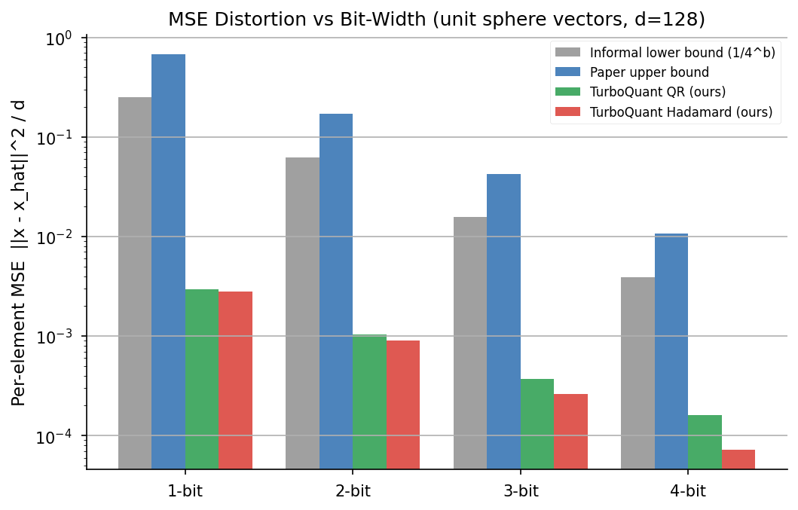

---

### 2. Codebook Centroids (True Sphere Distribution)

Unlike the original KVQuant which uses a Gaussian approximation, we fit Lloyd-Max centroids directly to the **true unit-sphere marginal distribution** `f(t) ∝ (1 - t^2)^{(d-3)/2}`. This gives tighter quantization, especially at low bit-widths and small `d`.

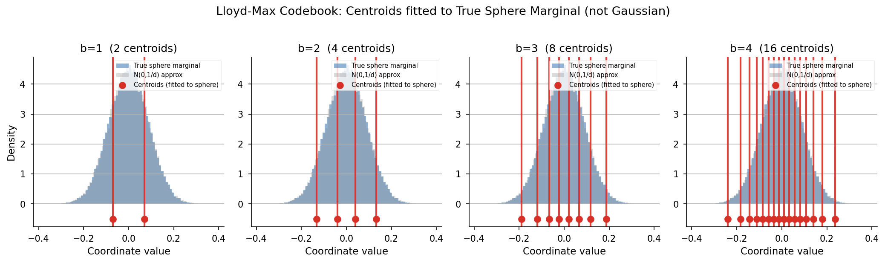

---

### 3. Rotation Effect

Random rotation (QR or Hadamard) transforms raw KV coordinates - which have arbitrary non-Gaussian distributions - into approximately N(0, 1/d), enabling optimal per-coordinate Lloyd-Max quantization.

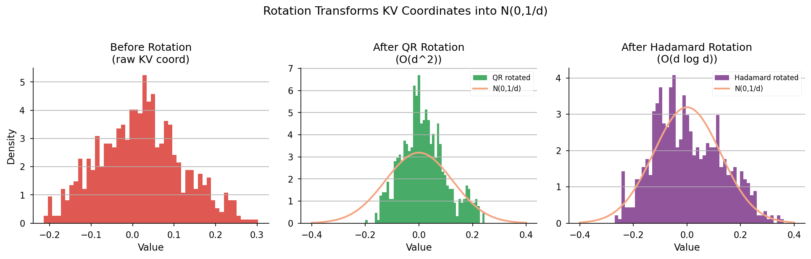

---

### 4. Attention-Weighted Quantization (Extension 1)

Rather than allocating bits uniformly, AWQ assigns more bits to tokens that receive high attention from queries. At the same average bit-width, this reduces **attention-weighted distortion by 56.5% on average** across all distilgpt2 layers.

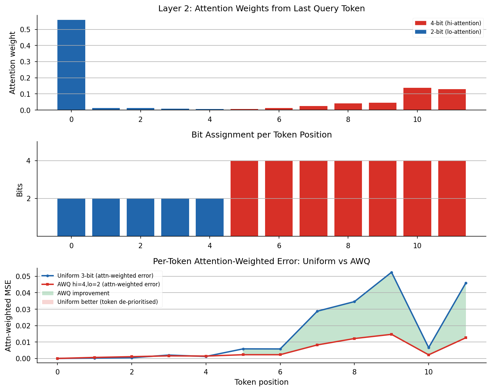

---

### 5. Delta Compression (Extension 2)

Consecutive KV vectors are highly correlated. Compressing token-to-token deltas `δ_t = k_t - k(cap)_{t-1}` instead of absolute vectors gives **1.1–2.2× lower MSE**, especially in early layers with smoother trajectories.

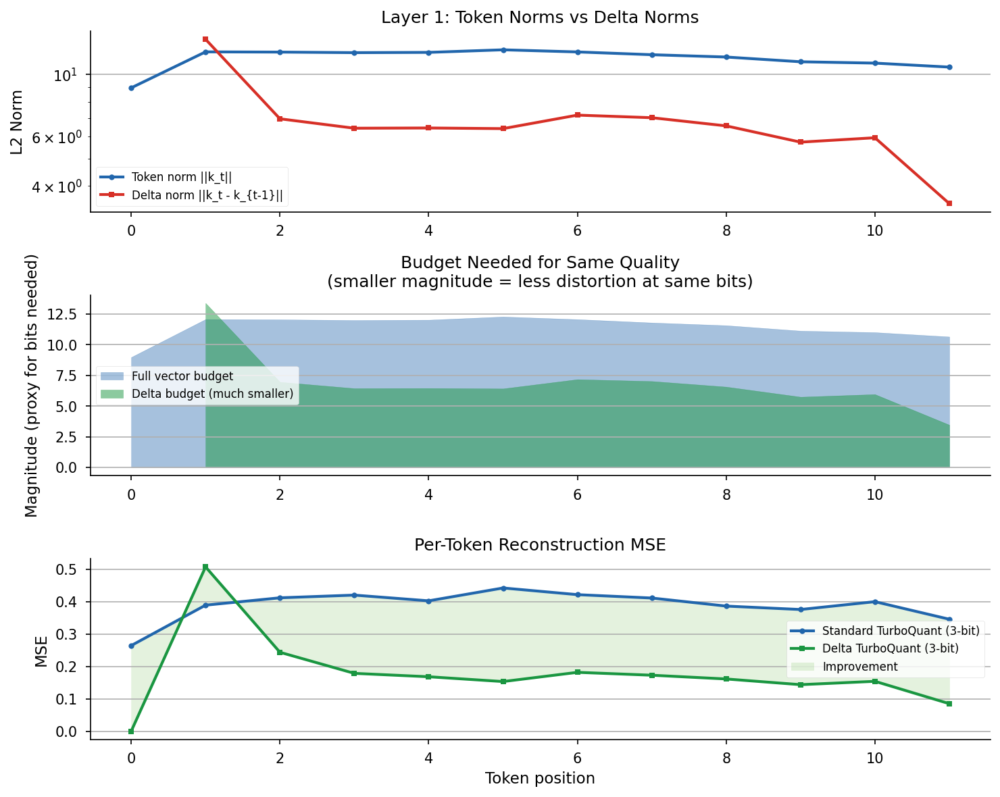

---

### 6. Adaptive Bit Allocation (Extension 3)

Token importance evolves during generation. An EMA-based importance tracker dynamically reassigns bit-widths as attention scores accumulate, giving more bits to tokens that prove important over time.

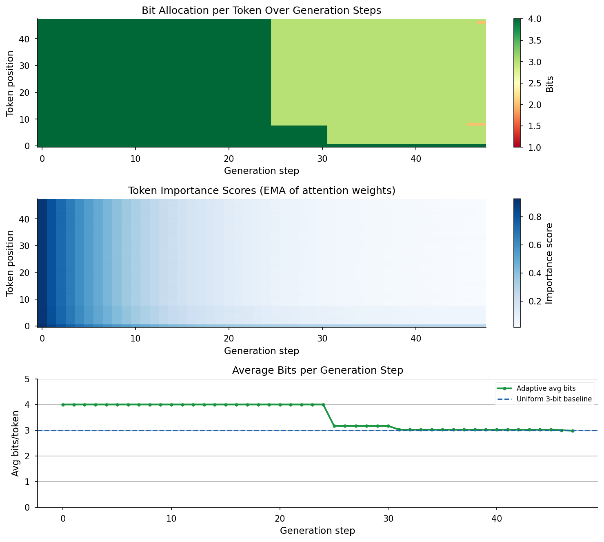

---

### 7. Low-Rank Error Correction (Extension 4)

Quantization error `R = K - k(cap)` is structured - its top singular vectors capture most of the error energy. A rank-r SVD correction reduces MSE by **~11% at rank-4** using only 6.3% extra storage.

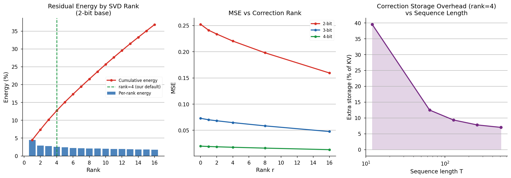

---

### 8. Entropy Coding

Codebook indices are non-uniformly distributed after rotation. Huffman coding reduces storage toward the Shannon entropy - at 4-bit, d=128: ~5% savings.

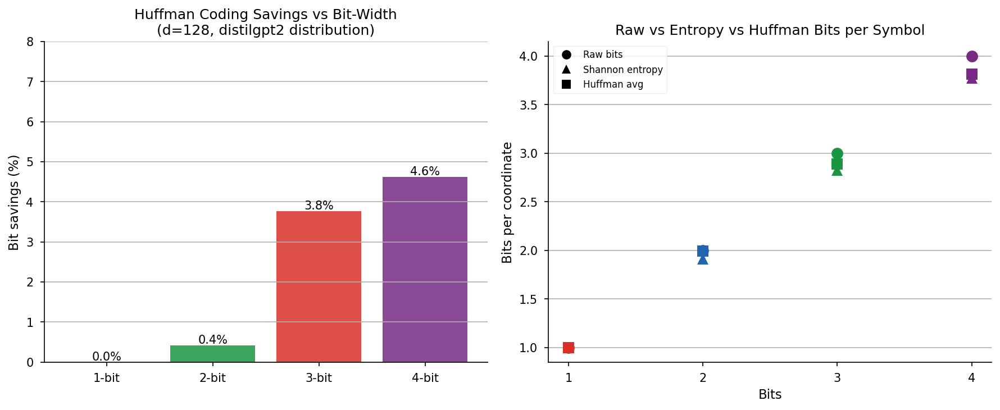

---

### 9. Full Pipeline Comparison

End-to-end comparison of baseline KVQuant vs the combined KVQUANT++ pipeline across all layers and bit-widths.

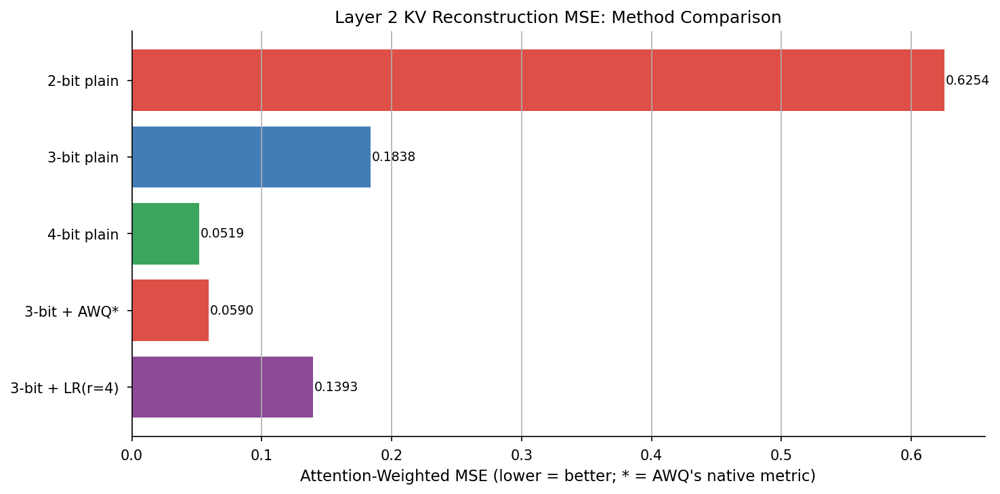

---

### 10. Compression Ratio

Storage cost vs reconstruction quality across configurations.

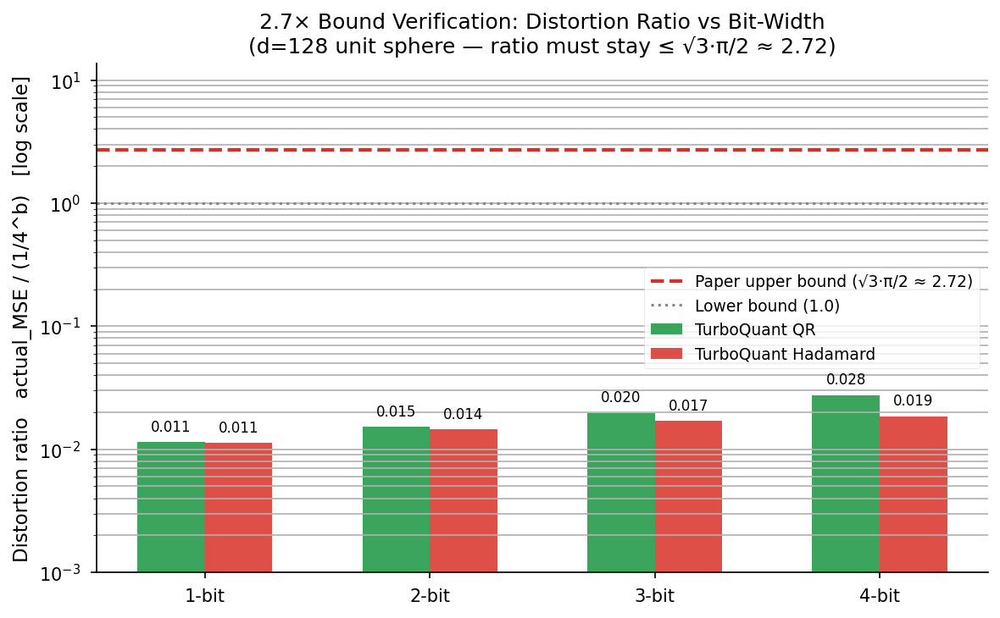

---

### 11. Perplexity Validation

End-to-end perplexity on distilgpt2 confirms that quantization quality improvements preserve language modelling performance.

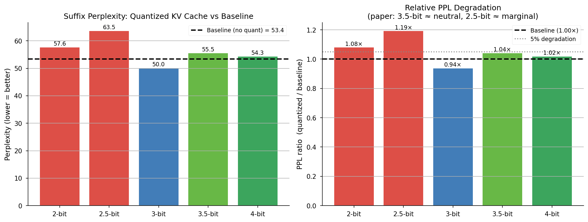

---

## Installation

### 1. Create and activate a conda environment

```bash
conda create -n kvquant python=3.11 -y
conda activate kvquant
```

### 2. Install PyTorch

Follow the instructions at https://pytorch.org/get-started/locally/ for your platform, or for a CPU-only install:

```bash
pip install torch --index-url https://download.pytorch.org/whl/cpu
```

### 3. Install the package (editable)

Run this from the `kvquant/` directory (the folder that contains `pyproject.toml`):

```bash
pip install -e .
OR
pip install -e ".[dev]"
```

This installs all dependencies (`torch`, `transformers`, `numpy`, `matplotlib`) and `pytest`, and makes the `kvquant` package importable from anywhere as long as the `kvquant` conda environment is active.

**Requirements:** Python ≥ 3.10, PyTorch ≥ 2.1, Transformers ≥ 4.40

### 4. Configure VS Code (optional)

1. Open VS Code in the `kvquant` folder.
2. Press `Ctrl+Shift+P` → **Python: Select Interpreter** → choose the `kvquant` conda environment (path will look like `~\anaconda3\envs\kvquant\python.exe`).
3. Press `Ctrl+Shift+P` → **Developer: Reload Window**.

If Pylance still shows `Import "kvquant" could not be resolved`, add this to your `.vscode/settings.json`:

```json
{
  "python.analysis.extraPaths": [".."]
}
```

(The `..` points one level above the `kvquant` folder so that `import kvquant` resolves correctly.)

---

## Running demos

Run demos as **modules** from inside the `kvquant` directory with the `kvquant` env active:

```bash
python -m kvquant.demo              # basic quantization examples
python -m kvquant.demo_llm          # real distilgpt2 KV cache compression
python -m kvquant.demo_extensions   # all 4 extensions on real data
python -m kvquant.visualize         # regenerate all plots -> plots/
```

---

## Quick start

```python
from kvquant import KVCacheQuantizer

# Standard 2-bit KV cache quantization
quant = KVCacheQuantizer(head_dim=64, num_bits=2)
quant.calibrate(keys)
k_compressed = quant.compress(keys)
k_reconstructed = quant.decompress(k_compressed)

# Attention-weighted quantization
from kvquant import AttentionWeightedQuantizer
awq = AttentionWeightedQuantizer(head_dim=64, hi_bits=4, lo_bits=2, top_fraction=0.5)
q_weighted = awq.quantize(keys, attn_weights=attn_scores)

# Delta compression for streaming
from kvquant import DeltaKVCache
delta = DeltaKVCache(head_dim=64, num_bits=3)
for token_key in stream:
    compressed = delta.push(token_key)

# Low-rank error correction
from kvquant import LowRankCorrection
lrc = LowRankCorrection(head_dim=64, num_bits=2, rank=4)
k_corrected = lrc.forward(keys)
```

---

## Running tests

```bash
python -m pytest test_kvquant.py -v   # 78 tests, all pass
# or simply:
pytest
```

---

## Implementation improvements over reference

| | Reference | KVQUANT++ |
|---|---|---|
| Codebook distribution | Gaussian approximation | **True sphere marginal** |
| Rotation | May produce reflections (det = −1) | **SO(d) enforced** (det = +1) |
| Nearest-centroid lookup | `argmin` - O(N·d·k) | **`bucketize`** - O(N·d·log k), 14–22× faster |
| FWHT | 2 clones per butterfly level | **In-place**, 1 allocation per level |
| Extensions | None | **4 novel extensions** |
| Entropy coding | Not present | **Huffman coding** on indices |
| High-level API | None | **`KVCacheQuantizer`** for (B,H,T,d) tensors |

---

## Architecture

```
kvquant/
├-- quantizer.py       # KVQuantMSE, KVQuantIP
├-- rotation.py        # RandomRotation (QR), HadamardRotation (WHT)
├-- codebook.py        # Lloyd-Max on true sphere distribution
├-- entropy.py         # Huffman coding on indices
├-- outlier.py         # Per-channel bit allocation for outliers
├-- kv_cache.py        # KVCacheQuantizer - high-level (B,H,T,d) API
├-- attn_weighted.py   # Extension 1: attention-weighted quantization
├-- delta.py           # Extension 2: delta / temporal compression
├-- adaptive.py        # Extension 3: EMA-based adaptive bit allocation
└-- correction.py      # Extension 4: low-rank error correction
```

---

## Citation

```bibtex
@misc{kvquantpp2025,
  title   = {KVQUANT++: Attention-Aware and Structure-Exploiting Extensions
             to Near-Optimal Vector Quantization for KV Cache Compression},
  year    = {2025},
  note    = {Extensions of KVQuant (Zandieh et al., arXiv:2504.19874)}
}
```
